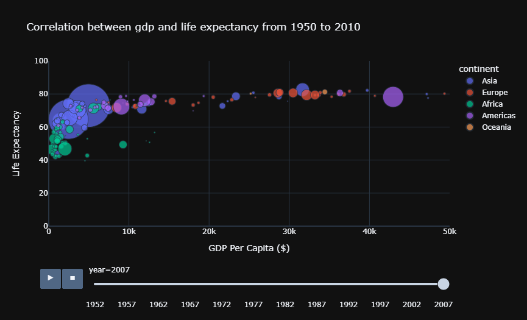
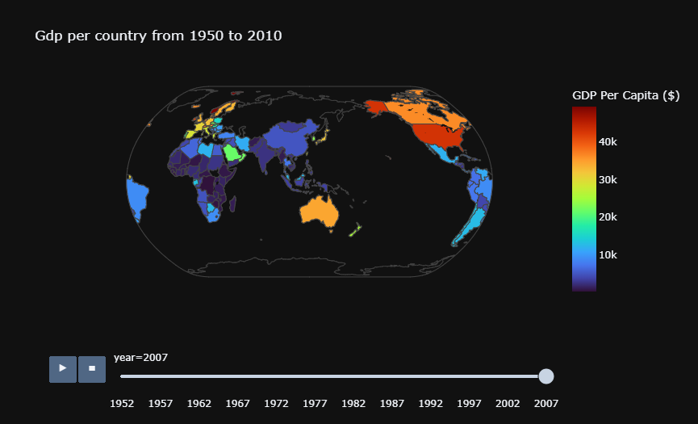

# world_demographic_indicators
Vizualisation of various demographic indicators thanks to the Gapminder dataset and Plotly Express

Free data provided by world banck via gapminder.org, CC-BY License.

## Installation

### Conda Virtual Environment
After downloading the project, open anaconda prompt and write : cd <directory_path>
conda env create -f environment.yml

## Thanks

- Jubayer Hossain for his kaggle : Explore the Gapminder Dataset with Plotly Express https://www.kaggle.com/jhossain/explore-the-gapminder-dataset-with-plotly-express